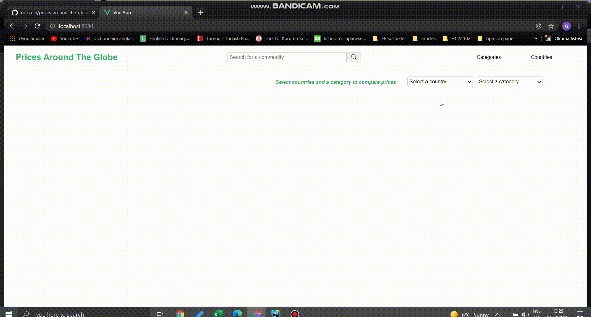
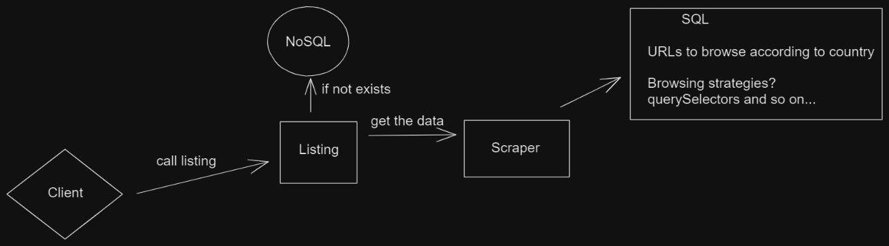
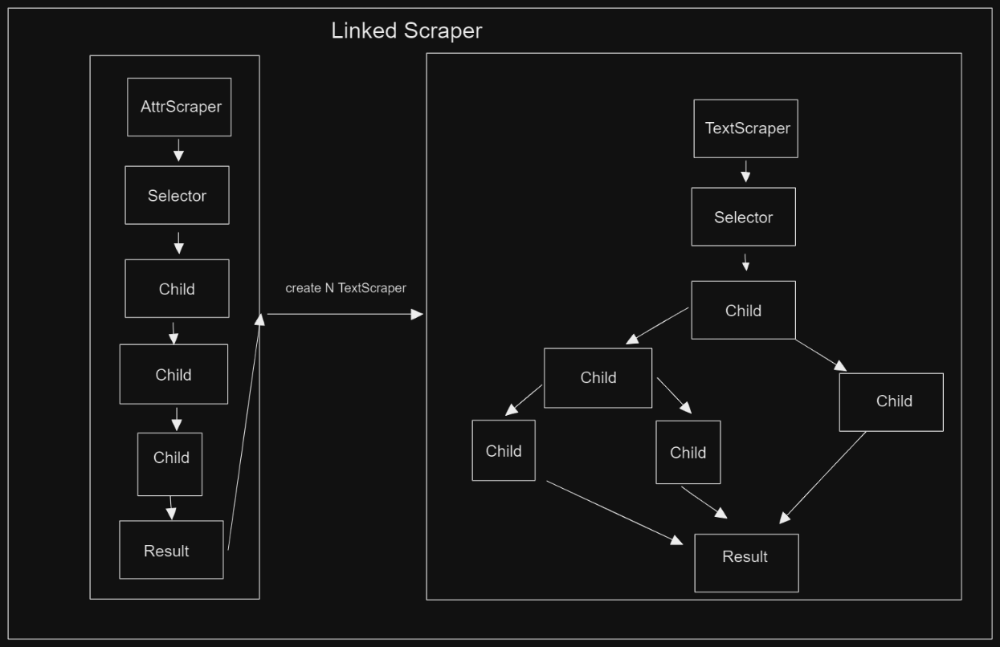

# Prices Around the Globe

__Prices Around the Globe__ will be a web application that allows users to compare prices from around the world. Basically, the app will scrape data from the web and merge those data in a user-friendly way with country and product options.

## Getting Started

Run the application using docker.

```bash
# go inside the scraper folder
$ docker build . -t scraper
$ docker run scraper
```

Run the application using docker-compose.

```bash
# go to root directory
$ docker compose up
```

## User Interface

Below is the current design idea of the UI. You can see the comparison tool and categories:car sections.



## Design

Below is a diagram of the app design:



Below is a diagram of linked scraper design:

